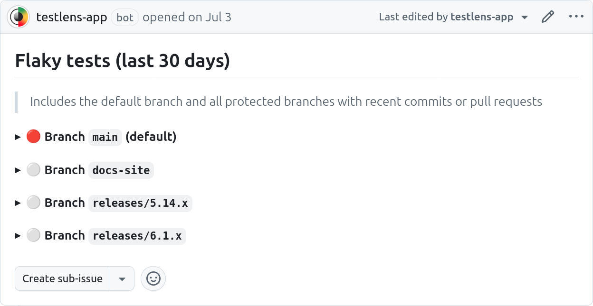
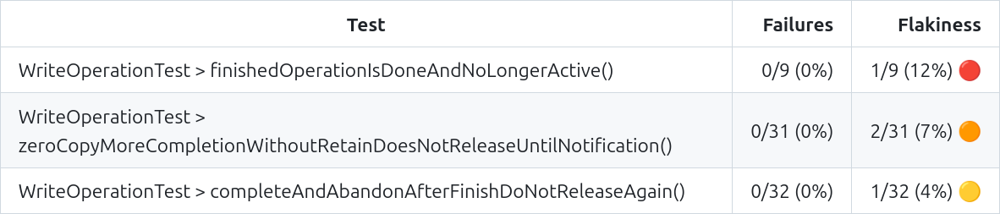

The Test Dashboard is a GitHub issue that is created by TestLens after a repository is onboarded.
It provides an overview about test flakiness in the repository in the last 30 days.

The dashboard lists the [default branch](https://docs.github.com/en/repositories/configuring-branches-and-merges-in-your-repository/managing-branches-in-your-repository/changing-the-default-branch) (usually `main`) and all [protected branches](https://docs.github.com/en/repositories/configuring-branches-and-merges-in-your-repository/managing-protected-branches/about-protected-branches).

The severity of test flakiness is indicated by one of the following icons:

- ⚪ / 🟢 – no executions were flaky
- 🟡 – at least one execution was flaky
- 🟠 – at least 5% of executions were flaky
- 🔴 – at least 10% of executions were flaky

For each branch, there are two sections:

- _Branch and pull request builds:_ only tests with _flaky_ results are included. Since it's expected for pull requests to initially contain some test failures, failed results are excluded.
- _Branch builds:_ both tests that had _failed_ or _flaky_ are included. Including failed outcomes can be useful to discover tests that are problematic because the regularly or occasionally fail after pull requests have been merged.

For each section, all tasks (for Gradle) or projects (for Maven) that had relevant test results in the last 30 days are listed.
The table shown for each task/project is ordered by flakiness so the most flaky tests are at the top.

## Example dashboards

- [JUnit](https://github.com/junit-team/junit-framework/issues/5831)
- [Netty](https://github.com/netty/netty/issues/17130)
- [Spock](https://github.com/spockframework/spock/issues/2392)
