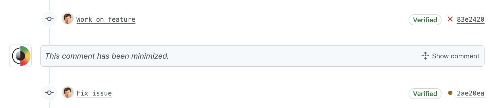
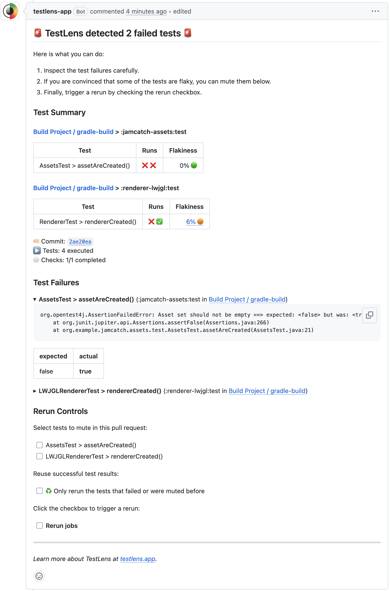

Each time you push a new commit to a Pull Request, TestLens posts a comment with _information_ and _controls_
that enables you to assess and act on test failures. While jobs on your PR are running, TestLens automatically
updates the comment as soon as new relevant information appears. This allows you to inspect and act on a failing test
as soon as the failure appears and not only after all jobs finished.

## Comment Lifecycle

- The TestLens comment shows the test status of running and completed jobs of the latest commit on your Pull Request.
- The comment is live: as soon as a test failure occurs, the comment is updated.
- When a new commit is pushed to your Pull Request, the TestLens comment for the previous commit is minimized.
  Once TestLens creates a comment for your new commit, the previous comment is removed.

## Comment Structure

The comment consists of three sections:

- [Test Summary](#test-summary) – a live summary of problematic tests in all job (re)runs for the current commit
- [Test Failures](#test-failures) – details of failing tests: available for your inspection as soon as a failure occurs
- [Rerun Controls](#rerun-controls) – checkboxes to schedule reruns to counteract flakiness with the option to mute selected tests

### Test Summary

The test summary shows live tables that contain all test failures for the current commit for all jobs and (re)runs.
Each row shows the status of all reruns. You can see, for example, if a test failed initially but succeeded in a rerun
❌ ✅. For test statuses, the following symbols are used:

- ❌ _Failed_ – the test failed in this (re)run
- ⚠️ _Flaky_ – the test was executed several times during this (re)run, failed first and then succeeded
  (may happen in a setup that uses the [test retry Gradle plugin](https://github.com/gradle/test-retry-gradle-plugin) or a similar solution)
- ✅ _Successful_ – the test succeeded in this (re)run
- ♻️ _Successful reused_ – the test was successful in the previous (re)run and not re-executed in this rerun
  (may happen if a _reuse results rerun_ was triggered via [Rerun Controls](#rerun-controls))
- 🔇 _Muted_ – Test was not executed because it was explicitly muted in this comment
- ⏭️ _Skipped_ – Test was skipped in this (re)run
  (may happen in dynamic test setups)
- 🚫 _Missing_ – Test was not executed in this (re)run
  (may happen in dynamic test setups)
- 🛑 _Aborted_ – Test was aborted in this (re)run

For each test, you also see a flakiness score (in %) that indicates if the test was flaky before. A flakiness score
that is higher than 0% may indicate that a failure is not caused by a change in the current PR, but rather a known
flakiness issue. And that hence a rerun may be sufficient as solution for the current PR.

### Test Failures

If the [Test Summary](#test-summary) tables contain test failures, the failure details can be inspected here.
This gives further context about why a test fails. Based on this, you can either go about fixing issues in your PR
or trigger a rerun via the [Rerun Controls](#rerun-controls) if the failure is due to flakiness. In cases where a
known issue should be temporarily ignored, you can mute selected tests in the [Rerun Controls](#rerun-controls) before triggering a rerun.

### Rerun Controls

The rerun controls allow you to directly trigger a rerun of GitHub action workflows that contain failed tests.
This has advantages over triggering such reruns in the native GitHub UI:

- `🔲 Rerun jobs` button at your fingertips – TestLens automatically selects which workflows/jobs need a rerun
- `🔲 ♻️ Only rerun the tests that failed or were muted before` to speed up the rerun by not re-executing tests
  that were already successful
- `🔲 TestClass > testName()` to mute a test – available for each test that failed in previous (re)runs
