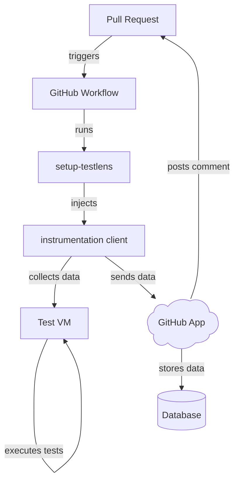

TestLens is a platform that captures data about all your tests while they are running.
This page explains what is does, how it works, which features it has.
If you want to onboard your own project quickly, head over to [Prerequisites](/docs/introduction/prerequisites).
If you're interested TestLens' features, go to the [Features section](/docs/features/pr-comment).

TestLens consists of three parts:

- A [GitHub App](https://github.com/marketplace/testlens-app) that you need to install into your GitHub account.
- A [GitHub Action](https://github.com/marketplace/actions/set-up-testlens) that you need to add to you GitHub Actions Workflows.
- An instrumentation client that is injected into each JVM that is executing tests by the setup-testlens action.

Here's an overview of how the system works:

When a GitHub actions workflow runs in your repository and the setup-testlens action is present, the action injects TestLens' instrumentation client into each JVM running tests.
Currently [Gradle](https://gradle.org) and [Apache Maven&trade;](https://maven.apache.org) are supported.
Furthermore tests must be executed via a test engine that runs on top of [JUnit Platform](https://junit.org).
This includes &mdash; but is not limted to &mdash; [JUnit Jupiter](https://docs.junit.org/current/writing-tests/intro.html), [Spock Framework](https://spockframework.org), and [KoTest](https://kotest.io).
The instrumentation client opens a connection to the TestLens GitHub App and streams data about the test environment, test results, and test failures while your tests are running.
GitHub notifies TestLens once any workflow completes, and TestLens responds to this event by posting an [informative comment](/docs/features/pr-comment), that summarizes the results of any test execution that happened while the workflow was running.
Additionally TestLens detects flaky tests across all GitHub Actions workflow executions and summarizes them for you in the [Test Dashboard issue](/docs/features/dashboard).
